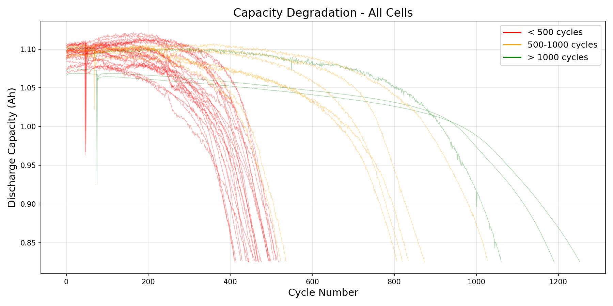
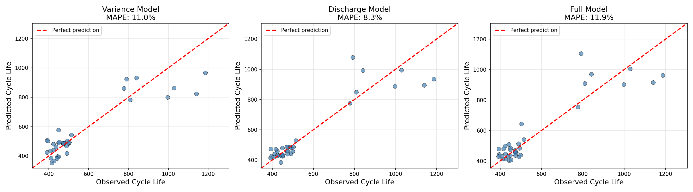
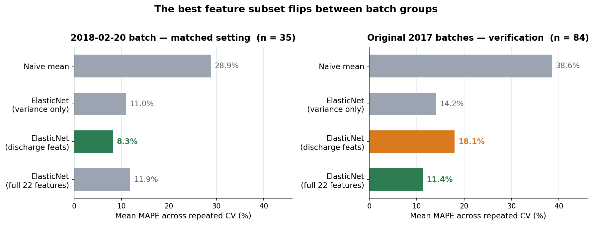

# Early-Life Battery Lifetime Prediction — Replication and Extension of a Severson-Style Pipeline

This repository contains the code release for an MSc dissertation project in Innovative Design and Technology at The University of Hong Kong. Author: Junfeng Jiang.

The project reconstructs a Severson-style early-life battery lifetime prediction workflow on public fast-charging battery data, then extends the workflow through broader model comparison, interpretability analysis, early-window analysis, full-data evaluation, cross-batch testing, and conservative statistical checks.

## Data

The data are from the public Severson et al. battery lifetime dataset hosted at <https://data.matr.io/1>, the companion data platform for Severson et al., Nature Energy 2019.

This repository does not include raw data, processed data, model outputs, `.mat` files, `.pkl` files, or spreadsheets. Download the data from the public source and place the required files under:

```text
./data/MIT/
```

Main experiments use the following 2018 batch files:

- `2018-02-20_batchdata_updated_struct_errorcorrect.mat`
- `2018-04-03_varcharge_batchdata_updated_struct_errorcorrect.mat`
- `2018-04-12_batchdata_updated_struct_errorcorrect.mat`

Appendix A.7 verification uses the following original 2017 batch files:

- `2017-05-12_batchdata_updated_struct_errorcorrect.mat`
- `2017-06-30_batchdata_updated_struct_errorcorrect.mat`

## Pipeline

- `step1_load_and_explore_final.py` — Load public MATLAB battery files, convert them into Python dictionaries, apply continuation handling, and generate initial exploratory outputs.
- `step2_feature_engineering.py` — Build the Severson-style feature matrix, including 22 engineered early-cycle descriptors and baseline elastic-net models.
- `step3_ensemble.py` — Compare tabular models including elastic net, ridge, lasso, random forest, gradient boosting, support-vector regression, stacking, and lightweight neural baselines.
- `step3_deep_learning.py` — Run exploratory deep-learning baselines using sequence-style representations.
- `step3_deep_learning_pytorch.py` — Run exploratory PyTorch deep-learning baselines and related diagnostics.
- `step4_shap_and_early.py` — Run SHAP interpretability analysis, feature-group ablation, and early-window prediction experiments.
- `step5_full_data.py` — Extend the evaluation to the 75-cell feature matrix and run the broader repeated-CV comparison.
- `step6_final_polish.py` — Produce final cross-batch, full-data, and reporting figures used by the dissertation.
- `step7_fixes.py` — Run final strict out-of-fold diagnostics and Wilcoxon significance checks.
- `verify_2017_batches.py` — Run an independent 2017 batch verification of the workflow-level baseline behavior.

## Key Results

| Evaluation setting | Representative result |
|---|---:|
| 35-cell matched setting | Discharge-focused elastic net: 8.3% MAPE |
| 75-cell repeated CV | Gradient Boosting: 10.88% MAPE; Elastic Net: 11.00% MAPE; Wilcoxon p = 0.22 |
| Cross-batch holdout | Best forward result: about 16.5% MAPE; reverse tree-model errors reach about 50-60% MAPE |
| 2017 batch verification | Full-feature elastic net: 11.4% MAPE; naive baseline: 38.6% MAPE |

This is a workflow-level reconstruction on same-platform public data, not a cell-for-cell replication of the original study. "Batch 1/2" is a code-inherited label for the single 2018-02-20 batch.

## Example Figures

### Capacity degradation trajectories



### Baseline prediction panels



### 2017 verification subset comparison



## References

- Severson, K. A., Attia, P. M., Jin, N., Perkins, N., Jiang, B., Yang, Z., Chen, M. H., Aykol, M., Herring, P. K., Fraggedakis, D., Bazant, M. Z., Harris, S. J., Chueh, W. C., & Braatz, R. D. (2019). Data-driven prediction of battery cycle life before capacity degradation. *Nature Energy*.
- Zhang, Y., Tang, Q., Zhang, Y., Wang, J., Stimming, U., & Lee, A. A. (2020). Identifying degradation patterns of lithium ion batteries from impedance spectroscopy using machine learning. *Nature Communications*.

## License

This repository is released under the MIT License.
